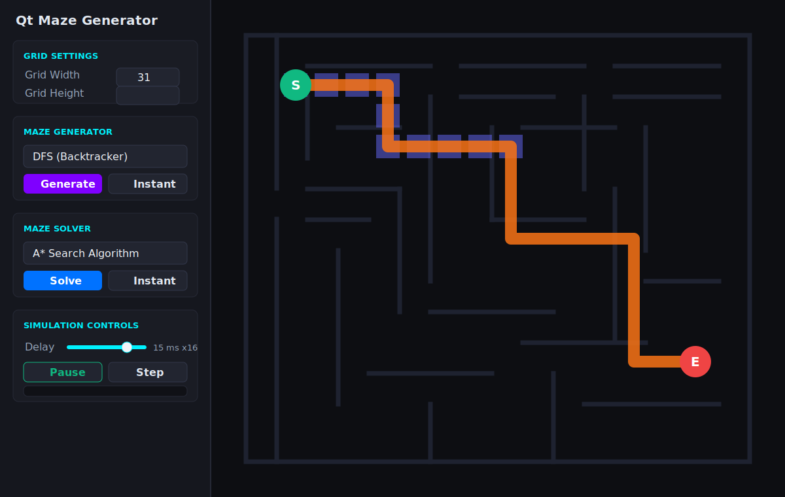

# Qt Maze Generator

Qt6/C++ で作った迷路自動生成・探索アプリです。



## Project Layout

```text
.
├── CMakeLists.txt
├── docs/
│   └── screenshot.svg
├── README.md
├── resources/
│   ├── app.ico
│   ├── app-icon.png
│   ├── app.rc
│   └── styles.qss
└── src/
    ├── main.cpp
    ├── MainWindow.cpp
    ├── MainWindow.h
    ├── MazeCanvas.cpp
    ├── MazeCanvas.h
    ├── MazeModel.cpp
    └── MazeModel.h
```

## Features

- DFS backtracker, Prim's algorithm, recursive division による迷路生成
- BFS, DFS, A* による経路探索
- アニメーション生成、即時生成、ステップ実行、一時停止、キャンセル
- マウス操作による壁の追加・削除、スタート/ゴール位置の移動
- ダークテーマのカスタム描画キャンバス
- Windows exe アイコン対応

## Requirements

- Qt 6
- CMake 3.21 or later
- Ninja or another CMake generator
- C++17 compiler

## Build on Windows

```powershell
C:\Qt\Tools\CMake_64\bin\cmake.exe -S . -B build -G Ninja -DCMAKE_PREFIX_PATH=C:\Qt\6.11.1\mingw_64
C:\Qt\Tools\CMake_64\bin\cmake.exe --build build --config Release
```

`build/` は生成物なので Git 管理から除外しています。

## Run

```powershell
.\build\QtMazeGenerator.exe
```

## Self Test

```powershell
.\build\QtMazeGenerator.exe --self-test
```

The self-test runs all generator and solver combinations and exits with a non-zero code if any path cannot be solved.

## CI

`.github/workflows/windows-build.yml` builds the application on GitHub Actions for Windows and runs the self-test.
