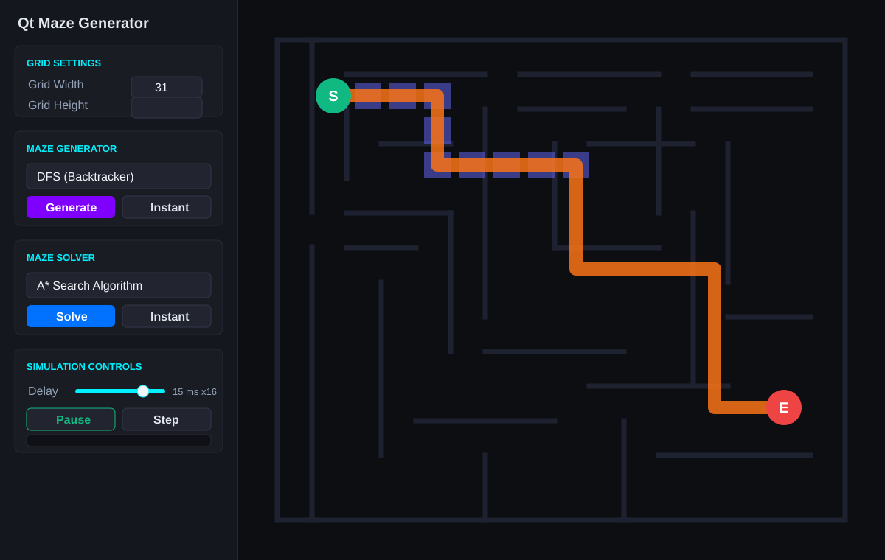

# Qt Maze Generator

A maze generation and pathfinding visualiser built with Qt6 and C++.



## Project Layout

```text
.
├── .github/
│   └── workflows/
│       └── windows-build.yml
├── CMakeLists.txt
├── LICENSE
├── README.md
├── docs/
│   └── screenshot.svg
├── resources/
│   ├── app.ico
│   ├── app-icon.png
│   ├── app.rc
│   └── styles.qss
└── src/
    ├── main.cpp
    ├── MainWindow.cpp
    ├── MainWindow.h
    ├── MazeCanvas.cpp
    ├── MazeCanvas.h
    ├── MazeGrid.h / .cpp       # the grid itself, and the carving helpers
    ├── MazeGenerator.h         # generator interface
    ├── MazeModel.cpp / .h      # state and signals
    ├── MazeModelGeneration.cpp # drives generation
    ├── MazeModelSolving.cpp    # BFS / DFS / A*
    └── generators/             # the thirteen algorithms, and the catalog
```

`resources/styles.qss` is compiled into the executable as a Qt resource, so
nothing has to be copied alongside the binary when distributing it.

## Features

- Thirteen maze generation algorithms (listed below)
- BFS, DFS and A* pathfinding
- Animated generation, instant generation, single stepping, pause and cancel
- Seeded generation, so a run can be repeated or one seed compared across
  algorithms
- Drawing and erasing walls with the mouse, and dragging the start and goal
- Custom-drawn dark canvas
- Windows executable icon

## Generators

Every algorithm produces a perfect maze: all cells connected, with no loops.
What differs is how it gets there and what the result feels like to walk. The
figures below are measured on an 88 x 47 grid of 4136 cells.

| Algorithm | Dead ends | Junctions | Longest path |
|---|---|---|---|
| Recursive Backtracker (DFS) | 10.5% | 10.3% | 1494 |
| Hunt-and-Kill | 9.6% | 9.4% | 604 |
| Prim's Algorithm | 34.9% | 29.0% | 261 |
| Kruskal's Algorithm | 30.5% | 26.2% | 304 |
| Boruvka's Algorithm | 27.4% | 24.8% | 372 |
| Growing Tree | 15.3% | 14.6% | 457 |
| Growing Tree (oldest first) | 2.1% | 2.0% | 221 |
| Wilson (Loop-Erased Walk) | 29.3% | 25.3% | 362 |
| Aldous-Broder (Random Walk) | 28.8% | 25.4% | 527 |
| Eller's Algorithm | 29.8% | 25.8% | 327 |
| Sidewinder | 28.3% | 25.3% | 233 |
| Binary Tree | 25.2% | 25.1% | 237 |
| Recursive Division | 15.4% | 14.4% | 546 |

Adding an algorithm means writing one class deriving from `MazeGenerator` and
appending one row to `src/generators/GeneratorCatalog.cpp`. The algorithm combo
box and the self-test both read the catalog, so neither needs to be touched.

## Requirements

- Qt 6
- CMake 3.21 or later
- Ninja or another CMake generator
- C++17 compiler

## Build on Windows

```powershell
C:\Qt\Tools\CMake_64\bin\cmake.exe -S . -B build -G Ninja -DCMAKE_PREFIX_PATH=C:\Qt\6.11.1\mingw_64
C:\Qt\Tools\CMake_64\bin\cmake.exe --build build --config Release
```

`build/` holds generated output and is excluded from version control.

## Run

```powershell
.\build\QtMazeGenerator.exe
```

## Self Test

```powershell
.\build\QtMazeGenerator.exe --self-test | Out-Host
if ($LASTEXITCODE -ne 0) { "self-test failed" }
```

The self-test runs every generator and solver combination and exits with a
non-zero code if any maze cannot be solved. It also checks that each generator
is reproducible from its seed, that every maze is a spanning tree, and that
each algorithm's share of dead ends and junctions and its longest path land in
the expected band, which is what distinguishes a correct implementation from
one that merely produces a connected maze. It needs no display, so it runs on a
headless machine.

`| Out-Host` is required. The executable is linked into the GUI subsystem, so
invoking it directly from PowerShell does not wait for it and leaves
`$LASTEXITCODE` untouched; piping makes PowerShell wait.

## CI

`.github/workflows/windows-build.yml` builds the application on GitHub Actions
for Windows and runs the self-test.
